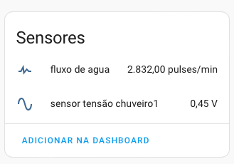

# medidor_fluxo_agua
Medidor de fluxo de água usando ESPHome

## Lista de materiais

- Weemos D1 mini v3 (https://pt.aliexpress.com/item/32831353752.html?spm=a2g0o.order_list.order_list_main.58.66c0caa4Gt99Q5&gatewayAdapt=glo2bra) [3]
- medidor de fluxo de água com sensor de temperatura (https://pt.aliexpress.com/item/1005001982191762.html?spm=a2g0o.order_list.order_list_main.41.66c0caa4Gt99Q5&gatewayAdapt=glo2bra)
- fonte 5V 1A
- cabo usb - micro USB

## Medindo o fluxo da água

A leitura da informação enviada pelo sensor é feita usando-se um pulse_counter no ESPHome. [1] [2]
  
    sensor:
      - platform: pulse_counter
        # GPIO5 = D1
        pin: GPIO5
        name: "fluxo de agua"
        update_interval: 5s

No código acima criamos um `sensor` chamado "fluxo de água" que vai indicar
a quantidade de pulsos do sensor (ainda não convertidos para uma métrica
do tipo "litros por minuto").

    sensor:
      - platform: pulse_counter
        # GPIO5 = D1
        pin: GPIO5
        name: "fluxo de agua"
        update_interval: 5s
        filters:
        - lambda: return (x / 27.0) * 60.0;
        unit_of_measurement: "L/hr"

## Medindo a temperatura da água

O sensor de temperatura é do tipo NTC, ou seja, sua resistência varia com a temperatura (quanto maior a temperatura, menor a resistência).

O vendedor (página do Ali Express) não dá detalhes sobre a curva de resposta do sensor então levantamos a curva na base da experimentação (meça a resistência à medida que varia a temperatura à qual o sensor é exposto). O resultado obtido foi o seguinte (temperatura em graus Celsius e resistência em Kilo Ohms):

Para usar um NTC com o Wemos D1 mini precisamos montar um divisor de tensão [4].

A temperatura da água do chuveiro vai ficar entre os 35 graus e os 45 graus, então
a resistência do termistor deve ficar entre aproximadamente 17 Kilo Ohms e 13 Kilo Ohms.

Vamos então usar um resistor de 10 Kilo Ohms e ver no que dá.

Essa configuração onde o termistor fica ligado no Vcc é denominada de UPSTREAM na documentação do 
Resistance Sensor do ESP Home.

Nesse ponto podemos escrever o seguinte código para esses 2 sensores:

    sensor:
      - platform: pulse_counter
        # GPIO5 = D1
        pin: GPIO5
        name: "fluxo de agua"
        update_interval: 5s
    
      - platform: adc
        pin: A0
        name: "sensor tensão chuveiro1"
        update_interval: 15s

Carregando esse código (mais o código padrão gerado pelo ESP Home com Wi-Fi, etc) no Wemos D1 Mini, conectando todos os cabos de energia e sensores
e adicionando no Home Assistant, já temos o seguinte resultado (o termistor estava perto de um
aquecedor e eu estava soprando no tubo do cano pra ter alguma contagem de pulsos):

## Referências:

[1] https://community.home-assistant.io/t/using-esphome-to-build-a-water-flow-rate-meter/119380/4

[2] Pulse counter sensor: https://esphome.io/components/sensor/pulse_counter.html?highlight=pulse

[3] Pinagem do Wemos D1 mini: https://i2.wp.com/www.teachmemicro.com/wp-content/uploads/2019/07/wemos-d1-mini-pinout.jpg?ssl=1

[4] Circuito divisor de tensão: https://www.petervis.com/electronics%20guides/calculators/thermistor/thermistor.html

